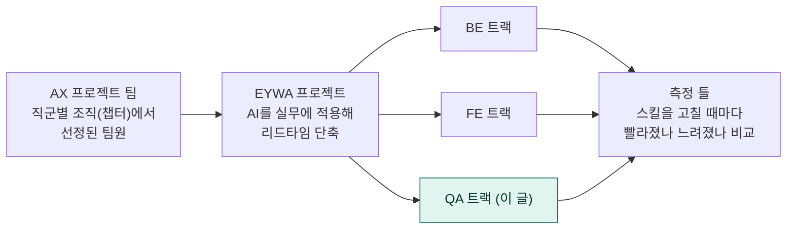
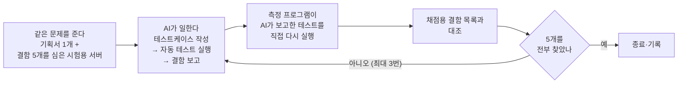
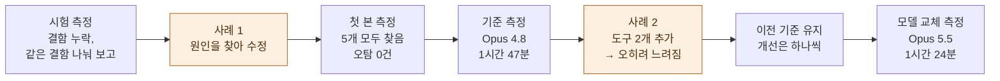

# QA 스킬 벤치마크

> 테스트케이스 작성·수행 시간 3시간 42분 → 1시간 24분, 62% 단축을 검증하다

**프로젝트 정리** · [심화](docs/deep-dive.md) · [용어집](docs/glossary.md)

| | |
|---|---|
| **역할** | QA 트랙 주도. 백엔드용 측정 틀을 QA 업무에 맞게 재설계하고, QA 전용 저장소 구성, 사람 실측, 측정 운영, 결과 분석을 맡았다 |
| **목표** | QA용 AI 스킬이 테스트케이스 작성과 수행 시간을 실제로 줄이는지 숫자로 확인한다 |
| **결과** | 같은 기획서 기준 소요 시간이 사람 **3시간 42분**에서 스킬을 쓴 AI **1시간 24분**으로 **62% 줄었다.** 미리 심어 둔 결함 5개는 3번 모두 첫 시도에 전부 찾았다 |

> 회사 이름, 내부 식별자, 대상 기능의 세부 화면 동작은 일반화했다. 전문 용어는 [용어집](docs/glossary.md)에 모았다.

---

## 1. 배경과 문제

**EYWA 프로젝트.** AX 프로젝트 팀의 첫 프로젝트로, AI를 실무에 적용해 **리드타임**(일을 시작해서 끝낼 때까지 걸리는 시간)을 줄이는 것이 목표다. BE, FE, QA가 각자 AI 스킬(AI에게 주는 업무 절차와 규칙 묶음)을 만들고, 그 스킬이 정말 시간을 줄이는지 측정 틀(벤치마크)로 잰다.

**문제.** QA 업무(테스트케이스를 쓰고 화면에서 직접 확인해 결함을 찾는 일)에 AI 스킬을 쓰면 "빨라진 것 같다"는 느낌은 쉽게 든다. 하지만 느낌만으로는 스킬 덕분인지 알 수 없다. 효과를 말하려면 조건을 똑같이 맞추고 여러 번 재서 비교해야 한다.

측정 틀은 백엔드 업무용으로 먼저 만들어져 있었다. QA는 결과물이 코드가 아니라 테스트케이스와 결함 보고서라서, 측정 방식을 새로 설계해야 했다.

## 2. 내 역할

백엔드 엔지니어가 만든 측정 틀을 가져와, **QA 업무에 맞게 다시 설계하고 QA 전용 저장소로 분리해 운영하는 일을 주도했다.** 설계부터 측정 운영과 결과 보고까지 QA 쪽 전 과정을 맡았다.

| 단계 | 한 일 | 결과물 |
|---|---|---|
| 설계 | AI에게 무엇을 시키고, 몇 번 시도하게 하고, 어떻게 채점하고, 무엇과 비교할지 개발 담당자와 논의해 정했다 | 방법론 문서의 QA 설계 부분, QA 전용 저장소(과제, 스킬, 측정 기록, 규칙 문서) |
| 준비 | 같은 기획서로 테스트케이스 66건을 쓰고 39건을 직접 수행해 시간을 쟀다 | 모든 비교의 출발점이 된 사람 기록(3시간 42분) |
| | 기획서에서 해석이 갈리는 부분을 QA 관점에서 검토했다. 테스트 계정과 접속 경로를 정의하고, 심어 둘 결함의 선정에 참여했다 | 모호한 항목을 확정한 기획서, 검토를 거쳐 봉인한 채점용 결함 5건 |
| 스킬 개발 | 테스트케이스 작성 스킬과 자동 테스트(E2E) 작성 스킬을 만들고, 측정 결과를 근거로 고쳤다 | 아래 사례 1, 사례 2 |
| 운영 | 전용 측정 머신에서 몇 시간짜리 측정을 반복해 돌렸다. 운영 사고 4건을 겪은 뒤 실행 절차를 문서로 정리했다 | 실행 절차서, 무효 처리한 측정과 그 사유를 적은 기록 |
| 분석과 보고 | 결과를 단계별로 나눠 해석하고 팀에 공유했다 | 자동 테스트 단계가 병목이라는 분석(사례 2의 출발점), 팀 발표 자료, 측정 이력 문서 |

**다른 역할과 함께한 부분**

| 역할 | 맡은 일 |
|---|---|
| 백엔드 엔지니어 | 측정을 자동으로 반복하는 프로그램(하네스)의 원형 |
| FE 담당자 | 시험용 서버의 결함 구현과 배포. 버전 번호를 자동으로 붙이는 장치와 사례 1의 수정 작업 지원 |

## 3. 어떻게 쟀나

같은 기획서로 **사람이 직접 한 시간**을 먼저 재고, 스킬을 쓴 AI와 비교했다. 공정한 비교를 위해 네 가지 원칙을 지켰다.

| 원칙 | 내용 |
|---|---|
| 스킬 말고는 모두 고정(통제 변수) | 기획서, 시험용 서버, AI 모델, 도구 버전을 고정했다. 하나라도 바뀐 측정은 무효로 처리했다 |
| 실제 실패로만 채점(테스트 재실행 검증) | AI가 "실패했다"고 보고하면 측정 프로그램(하네스)이 직접 다시 돌려 확인했다 |
| 채점용 결함 목록 격리(정답지 격리) | AI가 볼 수 없는 곳에 두고, 스킬을 고칠 때도 근거로 쓰지 않았다 |
| 기준은 측정 전에 확정(사전 등록) | 결과를 보고 기준을 바꾸지 않도록 미리 문서로 정했다 |

측정 1번에 1시간 26분에서 3시간 48분이 걸려, 조건마다 3번씩 반복했다. 이 밖의 결정과 이유는 [심화](docs/deep-dive.md)에 있다.

## 4. 결과에 이르기까지

측정 방법을 정했다고 바로 믿을 수 있는 결과가 나오지는 않았다. 본 측정 전에는 측정 자체가 제대로 돌아가는지부터 바로잡아야 했고(사례 1), 그 뒤에는 AI를 더 빠르게 만들려다 오히려 느려지는 일을 겪었다(사례 2). 아래 흐름도에 두 사례가 일어난 시점을 표시했다.

### 사례 1: 결함이 있는데도 테스트가 통과했다(거짓 통과)

**문제.** 본 측정 전 시험 측정에서 AI가 결함을 놓치거나, 같은 결함을 여러 번 보고했다. 원인을 모른 채 본 측정을 하면 결과를 믿을 수 없어서, 먼저 원인을 찾기로 했다.

**원인 찾기.** AI의 작업 기록을 처음부터 읽으며 어디서 판단이 틀렸는지 찾았다(근본 원인 분석). 채점용 목록은 보지 않았다. 목록에 맞춰 고치면 이 문제에서만 점수가 오르기 때문이다.

| 원인 | 고친 것 |
|---|---|
| 안내 문서의 접속 주소가 틀려, AI가 빈 화면을 보고 "정상"으로 판단했다 | 주소를 바로잡고, 역할별로 들어갈 수 있는 화면을 표로 정리했다 |
| 계정을 바꿀 때 브라우저 데이터를 통째로 지워, 확인할 데이터까지 사라졌다. 그래서 "없어야 한다"는 테스트가 항상 통과했다 | 계정은 로그아웃 버튼으로만 바꾸고, 데이터를 지우는 코드는 린트 규칙으로 막았다. "없다"만 보지 않고 "있었다 → 바꿨다 → 없어졌다"를 모두 확인하게 했다 |
| 결함 하나가 여러 화면에 보이면 화면마다 따로 보고했다 | "하나를 고치면 나머지도 고쳐지는가"를 기준으로 1건으로 묶게 했다 |

**결과.** 수정 후 첫 본 측정에서 3번 모두 결함 5개를 전부 찾았고, 잘못된 보고는 0건이었다.

### 사례 2: 빨라지려고 넣은 개선이 오히려 느리게 만들었다(성능 회귀)

**문제.** 측정 시간의 87%를 자동 테스트 단계가 차지했다(병목). AI가 결함을 찾고도 시간 제한에 걸려 보고하지 못한 경우도 있었다. 시간을 줄이려면 이 단계부터 손봐야 했다.

**원인.** 작업 기록을 보니 AI가 스킬의 지시를 따르지 않았다. 지시대로 하면 3단계였고, 전체를 한 번에 실행하면 1단계였다. AI는 단계가 적은 쪽을 골랐고, 전체 실행을 기다리느라 시간을 썼다.

**시도.** 지시문을 늘리는 대신 3단계를 명령 한 번으로 끝내는 도구를 만들었다. 로컬에서는 대기 시간이 35분에서 1.3분으로 줄었다.

**결과.** 이 도구와 다른 도구 하나를 함께 넣고 본 측정을 하자 오히려 나빠졌다. 탐지율은 100%에서 87%로 떨어졌고, 소요 시간은 1시간 47분에서 3시간 1분으로 늘었다. 두 도구를 함께 넣어서 어느 쪽이 원인인지 가릴 수 없었다.

**대응.** 나빠진 측정은 비교 기준으로 쓰지 않았다. 이후 개선은 한 번에 하나씩 넣고 측정하기로 했다.

## 5. 결과

위 과정을 거쳐 얻은 공식 측정 결과다. Opus 4.8 측정이 비교 기준이고, Opus 5.5는 AI 모델을 바꿔 다시 잰 결과다.

| | 사람 | AI (Opus 4.8) | AI (Opus 5.5) |
|---|---|---|---|
| 1번 평균 소요 시간 | 3시간 42분 | 1시간 47분 | **1시간 24분** |
| 그중 테스트케이스 작성 | 2시간 0분 | 6분 | 6분 |
| 그중 수행 (AI는 자동 테스트 작성과 실행) | 1시간 42분 | 1시간 41분 | 1시간 18분 |
| 사람 대비 | — | 52% 단축 | **62% 단축** |
| 심어 둔 결함 5개 | — | 3번 모두 첫 시도에 전부 찾음 (탐지율 100%) | 3번 모두 첫 시도에 전부 찾음 (탐지율 100%) |
| 보고한 문제 수 (3번 합) | — | 16건 | 31건 |
| 보고 중 심어 둔 결함과 맞은 비율 (정확도) | — | 94% | 49% |

- 단축은 대부분 테스트케이스 작성에서 나왔다(95% 감소). 수행 단계는 Opus 4.8에서 사람과 거의 같았고, Opus 5.5에서 23% 줄었다.
- 사람 기록에는 테스트 항목을 고르는 시간이 빠져 있어, 실제 업무 시간은 이보다 길다.
- Opus 5.5는 테스트를 더 많이 만들어 보고가 늘었고, 그래서 정확도가 내려갔다. 늘어난 보고가 실제 결함인지는 확인 중이다.
- 측정용 문제(과제)가 1개뿐이라 이 결과는 파일럿으로 보고했다.

자세한 수치와 측정 이력은 [심화](docs/deep-dive.md)에 있다.

## 6. 배운 점과 다음 단계

두 사례에서 얻은 원칙은 다음과 같다.

1. **"통과"라는 결과만 보지 말고 무엇을 확인했는지 본다.** 사례 1처럼 확인할 대상이 사라진 테스트는 결함이 있어도 통과한다.
2. **AI는 지시문보다 쉬운 방법을 따른다.** 사례 2에서 지시를 더 적는 대신 올바른 방법을 쓰기 쉽게 만들었을 때 AI의 행동이 바뀌었다.
3. **개선은 한 번에 하나씩 넣고 잰다.** 사례 2처럼 여러 개를 함께 넣으면 결과가 나빠져도 원인을 찾을 수 없다.

| 다음 단계 | 이유 |
|---|---|
| AI가 추가로 보고한 문제가 실제 결함인지 가리는 방법 정하기 | 지금은 채점용 목록에 없는 보고를 맞다 틀리다 판단하는 단계가 없다 |
| 측정용 문제(과제) 늘리기 | 문제가 1개뿐이라 본 판정을 하지 못한다 |
| 결함이 있어도 통과하는 테스트를 막는 규칙 보강 | 사례 1과 비슷한 유형이 다른 형태로 다시 나왔다 |

## 7. 더 읽기

- [심화](docs/deep-dive.md): 측정 장치의 구조, 채점 방식, 주요 결정과 버린 대안, 측정 이력
- [용어집](docs/glossary.md)

**사용 기술**: Claude Code(Opus 4.8, 5.5), Playwright, Python, AWS Bedrock, Git·GitHub Actions, Mermaid

> [!NOTE]
> **근거 자료**
>
> 저장소 README·방법론 문서·결정 로그·측정 유효성 대장·사람 실측 기록, 저장소 커밋 이력, 팀 발표 자료(2026-09-16), 작업 인계 노트(2026-09-15, 09-18, 10-01), 역할 범위는 본인 확인(2026-10-02, 10-03). 채점용 결함 목록의 내용은 어디에도 적지 않았다.
