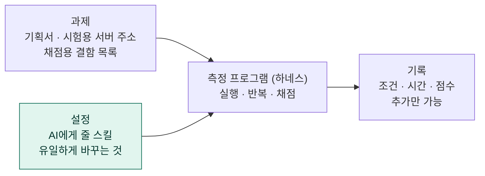
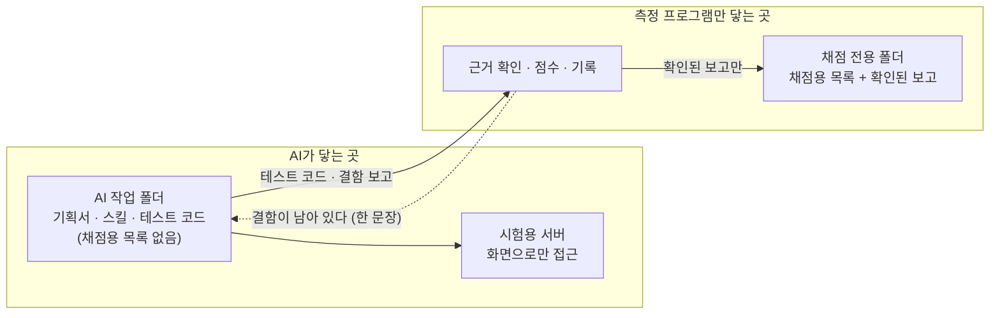

# 🔍 심화 — 측정 설계와 결과 상세

[프로젝트 정리](../README.md) · **심화** · [용어집](glossary.md)

> [프로젝트 정리](../README.md)를 읽은 뒤, 측정 장치가 어떻게 돌아가고 숫자를 어떻게 읽어야 하는지 더 알고 싶은 사람을 위한 글이다.

---

## 1. 측정 장치는 이렇게 돈다

저장소는 네 부분으로 나뉜다. 이 중 **설정(어떤 스킬을 줄지)만 바꾸고** 나머지는 고정한다.

측정 1번은 최대 3번의 시도(회차)로 이루어진다. 한 회차는 다섯 단계다.

| 단계 | 누가 | 하는 일 |
|---|---|---|
| ① 테스트케이스 작성 | AI | 기획서를 읽고 확인할 항목을 뽑는다 |
| ② 자동 테스트와 보고 | AI | 항목을 자동 테스트(E2E)로 바꿔 실행하고, 실패한 테스트를 근거로 결함을 보고한다 |
| ③ 근거 확인 | 측정 프로그램 | AI가 인용한 테스트를 직접 다시 실행해 실제로 실패하는지 확인한다 |
| ④ 정답 대조 | 채점 AI | 확인된 보고가 심어 둔 결함 중 무엇과 같은 문제인지 판단한다 |
| ⑤ 점수 | 측정 프로그램 | 탐지율과 정확도를 계산하고, 5개를 다 찾았으면 끝낸다 |

- 다 찾지 못하면 AI는 **"결함이 남아 있다"는 한 문장만** 받고 다음 회차를 시작한다. 몇 개가 남았는지, 무엇이 맞았는지는 알려 주지 않는다.
- 회차마다 AI 대화는 새로 시작하지만 작업 폴더는 그대로다. 이전 회차의 정보는 폴더에 남은 파일로만 전달된다.

## 2. 채점은 기계와 AI가 나눠 한다

**"테스트가 실제로 실패했나"는 기계가 확정하고, "그 실패가 어느 결함인가"만 AI가 판단한다.**

| 단계 | 하는 일 | 효과 |
|---|---|---|
| 근거 확인 (기계) | AI가 붙인 실행 로그를 쓰지 않고 테스트를 직접 다시 실행한다. 인용한 테스트가 실패 목록에 있어야 인정한다 | 말로만 쓴 보고, 통과하는 테스트를 인용한 보고가 빠진다 |
| 정답 대조 (채점 AI) | 채점용 결함 목록과 확인된 보고만 넣은 별도 폴더에서 대조한다. 결함 하나에 보고 하나만 매칭한다 | AI가 일하는 쪽으로 채점용 목록이 새지 않는다 |

**두 지표는 분모가 다르다.**

| 지표 | 계산 | 예: 보고 6건 중 근거 확인 4건, 그중 맞은 것 3건 |
|---|---|---|
| 탐지율 | 찾은 결함 수 ÷ 심어 둔 결함 수(5) | 3 ÷ 5 = 60% |
| 정확도 | 맞은 보고 수 ÷ 근거가 확인된 보고 수 | 3 ÷ 4 = 75% |

탐지율만 보면 보고를 많이 할수록 유리하다. 그래서 정확도를 함께 봐서 무분별한 보고를 견제한다.

AI 쪽으로 돌아가는 정보는 점선 하나뿐이다.

## 3. 주요 결정과 버린 대안

| 질문 | 선택 | 이유 | 버린 대안 또는 대가 |
|---|---|---|---|
| 무엇과 비교하나 | 사람이 직접 한 기록 | 알고 싶은 것이 "실무 시간이 얼마나 줄었나"다 | 스킬 없는 AI와 비교하면 스킬 효과를 따로 볼 수 있지만, 실무 단축은 말할 수 없다. 대가로 스킬 효과와 AI 도입 효과가 섞인다 |
| 소스코드를 주나 | 주지 않고 화면으로만 검증 | 결함이 있는 코드를 정답으로 삼으면 결함을 통과시키는 테스트를 쓴다 | 실제 개발 환경보다 정보가 적다 |
| 문제의 크기는 | 기획서 전체 1개 | 실무 단위 그대로다 | 문제가 1개라 본 판정은 할 수 없다 |
| 회차 사이에 무엇을 알려 주나 | "남아 있다" 한 문장 | 정답을 흘리지 않고 재시도하게 한다. 덜 확인하면 회차가 늘어 시간이 더 들므로 시간도 정직하게 잴 수 있다 | "못 찾은 결함을 알려 주자"는 안은 버렸다. 사람은 그 정보를 받지 못해 비교가 깨진다 |
| 어떻게 채점하나 | 기계 근거 확인 + 채점 AI | 객관적인 실패 기록으로 채점한다 | 채점 AI 여러 개와 결함 변형 배포본을 쓰는 안은 운영 부담이 커서 버렸다. 대가로 채점 AI가 측정 AI와 같은 모델이다 |
| 몇 번 반복하나 | 3번 | 1번에 1시간 26분~3시간 48분이 걸린다 | 표준은 5번이다. 대가로 작은 차이는 가려내지 못한다 |
| 기획서가 모호하면 | 측정 전에 확정 | AI는 측정 중에 사람에게 되물을 수 없다. 모호하면 점수가 우연으로 갈린다 | 기획서 파일은 바꾸지 않고 확정 내용을 결정 기록에 남겼다. 파일을 바꾸면 이전 측정과 비교할 수 없다 |
| 운영자 환경은 | 측정마다 빈 설정으로 격리 | 스킬은 바꾸는 조건 자체라, 운영자의 개인 스킬이 섞이면 결과가 오염된다 | 실제로 격리 없이 돌린 측정에 개인 플러그인 20개가 섞인 일이 있어, 그 이전 측정은 모두 무효 처리했다 |

## 4. 사람 기록을 잰 방법

| 항목 | 방법 | 값 |
|---|---|---|
| 테스트케이스 작성 | 무작위로 고른 3건의 건당 시간 × 전체 66건 | 2시간 0분 38초 |
| 수행 | 39건을 실제로 수행한 전체 경과 시간 | 1시간 42분 |
| 합계 | | **3시간 42분 38초** |

**케이스별 시간과 전체 경과 시간을 함께 기록했다.** 케이스별 순수 조작 시간을 더하면 30분 20초로, 실제 경과 시간의 30%뿐이었다. 나머지 70%는 화면 읽기, 사전 조건 만들기, 계정 전환, 기록에 쓰였다. 순수 조작 시간만 쓰면 사람 시간을 크게 줄여 잡게 되므로 전체 경과 시간을 대표값으로 썼다.

이 숫자를 인용할 때 붙이는 단서는 세 가지다.

- 무엇을 테스트할지 고르는 시간이 빠져 있다. 실제 업무 시간은 이보다 길다.
- 1번 잰 기록이라 변동 폭을 알 수 없다.
- 같은 사람이 다시 재면 이미 화면을 알아서 빨라지므로, 재측정하지 않았다.

## 5. 공식 측정 이력

중간에 끊기거나 조건이 어긋나 무효 처리한 측정은 사유와 함께 기록에 남기고 아래 표에서는 뺐다.

| 날짜 | 모델 | 이전 측정 이후 바뀐 점 | 탐지율 | 정확도 | 첫 시도에 끝남 | 1번 평균 소요 |
|---|---|---|---|---|---|---|
| 08-30 | Opus 4.8 | 첫 본 측정 | 100% ×3 | 100% | 3번 중 1번 | 2시간 40분 |
| **09-17** | Opus 4.8 | 스킬 보강, 안내 문서 정정 | 100% ×3 | 100/83/100% | 3번 모두 | **1시간 47분** |
| 09-18 | Opus 4.8 | 도구 2개 추가 | 80/100/80% | 67/100/80% | 0번 | 약 3시간 1분 |
| **09-29** | Opus 5.5 | 모델과 도구 버전 교체 | 100% ×3 | 평균 49% | 3번 모두 | **1시간 24분** |

- **09-17이 비교 기준(기준선)이다.** 09-18은 모든 지표가 나빠서 기준으로 옮기지 않았다(프로젝트 정리의 사례 2).
- 08-30 측정은 이후와 스킬, 안내 문서가 달라 나란히 비교하지 않는다. 이 측정에서는 시간의 87%를 자동 테스트 단계가, 12%를 테스트케이스 단계가 썼다.
- 09-29는 비교 기준 후보이며 지정 여부는 아직 판정하지 않았다.

**09-29에 정확도가 내려간 이유.** Opus 5.5는 테스트케이스를 더 많이 만들어(1번 평균 45건에서 60건) 실패한 테스트와 보고가 늘었다. 결함 하나에는 보고 하나만 매칭되므로, 정확도의 최댓값은 "5 ÷ 보고 수"다. 5.5는 세 번 모두 이 최댓값이었다. 채점 AI는 제품을 실행하지 않고 문구만 대조하기 때문에, 채점용 목록에 없는 보고가 잘못된 보고(오탐)인지 새로 찾은 결함인지 가리는 단계가 아직 없다.

## 6. 단계별로 보면

비교 기준 측정(09-17, Opus 4.8)과 Opus 5.5 측정(09-29)을 사람 기록과 단계별로 비교했다.

| 단계 | 사람 | AI · Opus 4.8 (09-17) | AI · Opus 5.5 (09-29) |
|---|---|---|---|
| 테스트케이스 작성 | 2시간 0분 | 6분 (**95% 감소**) | 6분 (**95% 감소**) |
| 수행 (AI는 자동 테스트 작성과 실행) | 1시간 42분 | 1시간 41분 (거의 같음) | 1시간 18분 (23% 감소) |
| 채점 | 해당 없음 | 24초 | 23초 |
| 합계 | 3시간 42분 | 1시간 47분 (52% 감소) | 1시간 24분 (62% 감소) |

- 단축은 대부분 테스트케이스 작성에서 나왔다. Opus 5.5에서는 수행 단계도 사람보다 23% 짧아졌다.
- 두 구성 모두 AI가 쓴 시간의 93~94%가 자동 테스트 단계다(병목).
- 사람은 손으로 확인한 기록을 남기고, AI는 다시 돌릴 수 있는 자동 테스트 코드를 남긴다. 두 번째 회귀 검증부터는 이 코드를 다시 돌리면 되므로 AI 쪽이 더 빨라질 수 있다는 가설이 있지만, 이 가치는 현재 채점에 들어 있지 않다.
- 단계별 값은 측정 기록의 세션별 소요 시간을 합산해 계산했다.

## 7. 말할 수 있는 것과 없는 것

| 말할 수 있다 | 말할 수 없다 (이유) |
|---|---|
| 스킬을 쓴 AI의 1번 평균 소요가 사람 기록보다 짧다 (Opus 4.8 52%, Opus 5.5 62% 단축) | "스킬 덕분에 62% 단축" (AI 도입 효과와 스킬 효과가 섞여 있다) |
| 두 구성 모두 심어 둔 결함 5개를 3번 모두 첫 시도에 찾았다 (문제 1개 기준) | "스킬이 결함 탐지를 보장한다" (같은 스킬로 탐지율이 40~100%로 갈린 기록이 있다) |
| Opus 5.5에서 보고가 16건에서 31건으로 늘고 정확도가 94%에서 49%로 내려갔다 | "품질이 떨어졌다" 또는 "더 잘 찾는다" (늘어난 보고의 진위를 판단하는 단계가 없다) |
| 09-18 측정은 09-17보다 모든 지표가 나빴다 | 원인이 어느 도구인지 (각각 측정한 적이 없다) |

> [!NOTE]
> **근거 자료**
>
> 저장소 README·방법론 문서·결정 로그·측정 유효성 대장·사람 실측 기록, 측정 프로그램 소스(2026-10-01 확인), 작업 인계 노트(2026-09-15, 09-18, 10-01). 채점용 결함 목록의 내용은 어디에도 적지 않았다.
